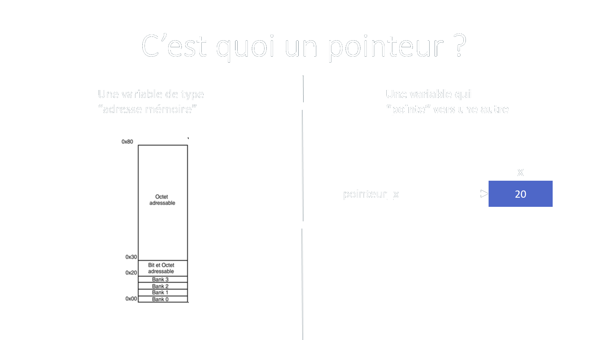
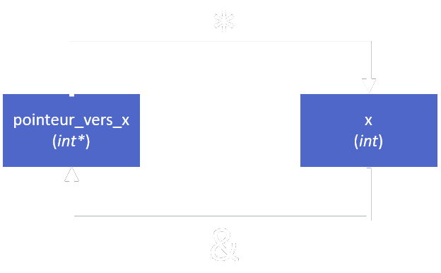
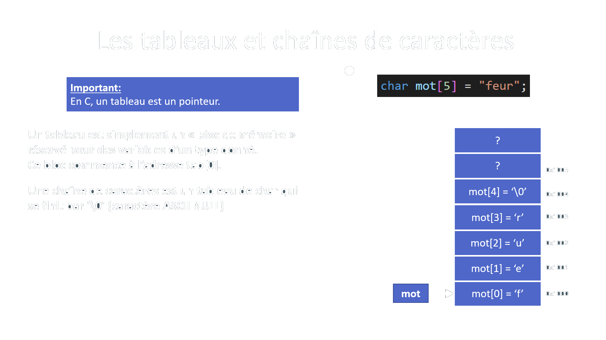
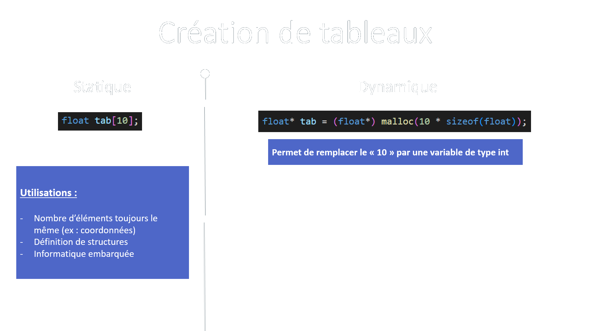
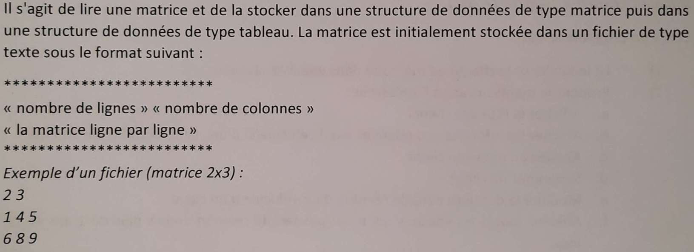
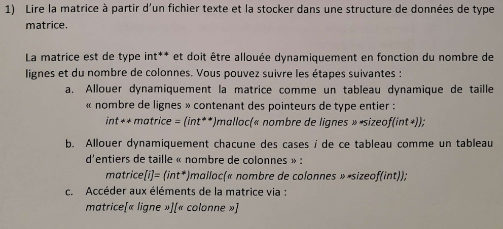
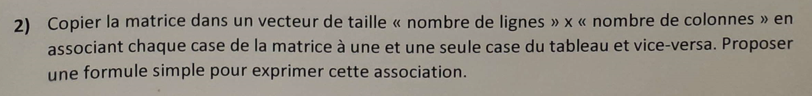
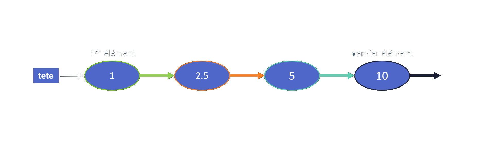
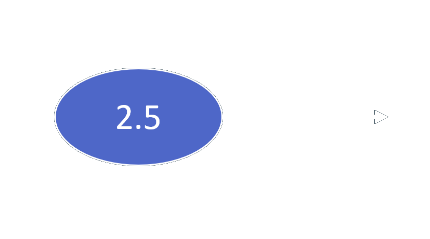
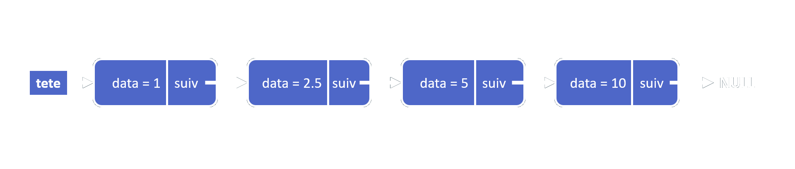

<!-- Pagination style -->
<style>
section::after {
  content: attr(data-marpit-pagination) '/' attr(data-marpit-pagination-total);
}
</style>

<!--Centered images -->
<style>
img[alt~="center"] {
  display: block;
  margin: 0 auto;
}
</style>


<!-- Title slide -->
<!--_footer: "Kézia MARCOU | AREM - 2023"-->
# Formation

## Algo-prog 1


---
# Remarques

- je peux faire des erreurs
- les slides et le code associé sont sur github et le site de l'AREM
- faites pas de bruit ça fait chier tout le monde (vous savez écrire)
- si c'est pas clair posez des questions
- __le C c'est 3 matières au prochain semestre__

---

## Sommaire

1. Les bases
2. Rappels de cours : pointeurs, tableaux
3. Exercice 1 sujet EI22 (lecture de fichiers)
4. Rappels de cours : listes chaînées
5. Petit guide du grattage de points
6. Comment debug une segfault
7. Conseils pour le projet

--- 
<!--header: "Section : Les Bases"-->
# Les bases 

### Types de variables

```c
/* Entiers */
int n; long m; long long p;

/* Caractères */
char c;

/* Flottants (~réels) */
float x; double y;
```

--- 
### Structures et types personnalisés

```c
struct Date
{
    int jour;
    int mois;
}; 

typedef char Lettre;

/* Exemple d'utilisation */
Lettre l = 'f';

struct Date d2;
d2.jour = 1;
d2.mois = 12;
```

--- 
### Structures et types personnalisés

```c
/* On peut créer un type et une structure d'un coup */
typedef struct Date
{
    int jour;
    int mois;
} Date; 

Date d1 = {1, 12}; // compact mais peu compréhensible

Date d2; // prend de la place mais on comprend
d2.jour = 1;
d2.mois = 12;
```

--- 
### Fonctions

```c
/* Initialise une date avec un jour et un mois */
Date initDate(int jour, int mois) {
    Date res;
    res.jour = jour;
    res.mois = mois;
    return res; // on sort de la fonction
}

void main() {
    Date d = initDate(1, 12);
    printf("Date : %d/%d \n", d.jour, d.mois); // Date : 1/12
    return 0;
}
```

---

### Fonctions - variables d'entrée/sortie

Les fonctions créent des copies des variables données en entrée.
Une variable créée dans une fonction n'en sort pas.

```c
int add(int a, int b) {
    int c = a + b;
    return c;
}
void main() {
    int a = 2; int x = 5;
    int res = add(a, x);
    // Quelles variables existent à  la fin du main ? Valeurs ?  
}
```

--- 
### If et for

```c
if(!n) { // equivalent à if(n == 0)
    return;
}
else {
    n = 10;
}

for(int i = 0; i < n; i++) {
    x += 0.2;
}
```

--- 
### Boules while

```c
while(n > 0) {
    n--;
}

// Execute le contenu de la boucle au moins 1 fois
do { 
    n--;
} while(n > 0);
```

Remarque : la boucle do...while est très peu utilisée.

--- 
### Switch/case

```c
switch(mois) { // switch ne fonctionne que sur des entiers ou chars
    case 1:
        printf("Janvier");
        break;
    case 2:
        printf("Février");
        break;
    default:
        printf("Mois inconnu");
        break;
}
```

Remarque : à connaître, et utiliser plutôt que 10 if/else if/...

--- 
<!--header: "Section : Pointeurs, tableaux" -->
# Rappels - pointeurs et tableaux

### Les pointeurs

C'est le concept le plus important du C. 
Vous avez absolument besoin de comprendre comment ils fonctionnent.

--- 



---

### Syntaxe des pointeurs



```c
int x = 1;
int* ptr_x; 
// int *ptr_x; // même résultat

ptr_x = &x;
```

| Important |
| --- |
| `&x` : l'adresse de x |
| `*ptr_x` : la variable pointée par ptr_x |

--- 

### Utilisation des pointeurs

1. Permettre à une fonction de modifier une variable extérieure
2. Création de tableaux / chaînes de caractères
3. Structures de données (listes, arbres, etc.)

*Vous allez très souvent en avoir besoin*.

--- 

### Fonctions modifiant une variable extérieure

```c
void carre(int* ptr_x) {
    *ptr_x = (*ptr_x) * (*ptr_x);
}

void main() {
    int x = 5;
    printf("x = %d \n", x); // x = 5
    carre(&x);
    printf("x = %d \n", x); // x = 25
}
```
La fonction ne renvoie rien, mais modifie x.

--- 



--- 



--- 

### Fonction "malloc" de stdlib

`malloc(n)` cherche une adresse avec un bloc de n octets libres, réserve ces octets, et renvoie un pointeur vers le début du bloc.

On l'utilise comme ceci : 
```c
int* tableau = (int*) malloc(nb_elements * sizeof(int)); // crée un tableau de 10 int.
//...
free(tableau); // libère la mémoire, donc détruit le tableau.
```

**Remarque** : en cas d'oubli , taper `man malloc` dans un terminal :D
**Remarque 2** : `malloc` n'initialise pas les éléments du tableau.

--- 
<!--header: "Section : ex1 sujet EI22"-->

# Ex1 sujet EI22



---



---



Correction :
- fonctions dans le dossier code/include/ex1_EI22
- code de test dans le main

Tout sera donné à la fin de la formation. 

--- 
<!--header: "Section : listes chaînées"-->

# Listes chaînées

### Concept général

La tête pointe vers le 1er noeud. Chaque noeud pointe vers le suivant.


---

### Les noeuds



Un noeud contient :
- Une valeur (ici nombre)
- Un lien vers le noeud suivant

Implémentation en C ? 

--- 

### Implémentation des noeuds

```c
typedef struct Noeud
{
    float data;
    struct Noeud* suiv;
} Noeud;
```

On a donc : 


---

### Ajout d'un élément au début

On écrit une fonction qui renvoie une copie de la liste avec un élément de plus au début.

```c
Noeud* addNoeud(Noeud* tete, float data) {
    Noeud* nouvelle_tete = (Noeud*) malloc(sizeof(Noeud));
    nouvelle_tete->data = data;
    nouvelle_tete->suiv = tete;
    return nouvelle_tete;
}
```
On pourrait écrire une fonction qui modifie la liste au lieu d'en renvoyer une nouvelle (avec une * de plus).

--- 

### Taille d'une liste

```c
int listLength(Noeud* tete) {
    int res = 0;
    while(tete != NULL)
    {
        res++;
        tete = tete->suiv;
    }
    return res;
}
```
Pour tester ces fonctions, allez récupérer la formation sur github (quand elle sera finie).

--- 
<!--header: "Section : grattage de points"-->

# Comment gagner des points

**Attention** : le test est *long*. *Très long*. 

Vous avez le droit à une clé USB. Emmenez :
- les corrections des TPs (que vous comprenez)
- des corrections d'annales (que vous comprenez)
- **(mieux) du code que VOUS avez écrit, et qui fonctionne**
- le cours si besoin

---

### Questions récurrentes

- lecture de fichiers 
- listes chaînées (création, manipulation, affichage)
- création d'un menu pour faire des actions
- manipulation de chaines de caractères (basique)

Arrivez avec du code fonctionnel pour ces exercices, avec un peu de chance il suffit de changer une struct et vous avez 8 points.

---
<!--header: "Section : debug une segfault"-->
# Comment debug une segfault

### C'est quoi une segfault

> Une erreur de segmentation (en anglais segmentation fault, en abrégé segfault) est un plantage d'une application qui a tenté d'accéder à un emplacement mémoire qui ne lui était pas alloué.

Source : Wikipédia

--- 

### Faire attention aux types de variables.

L'erreur la plus commune qui mène à une segfault est l'oubli d'un `&`.

Par exemple :
```c
void scanfClassic() {
    int n;
    printf("Entrer n :");
    scanf("%d", n); // scanf prend un int* en argument, pas un int
    printf("n = %d", n);
}
```

Faites attention aux warnings du compilateur. Ca devrait suffire ici.

--- 

### Connaitre les cas

Une segfault vient très souvent de : 
- une récursion infinie
- accès à une valeur qui n'existe pas dans un tableau
- utilisation de variables non initialisées (**allocation de mémoire**)

Faites attention !

--- 

### Utiliser le debuggeur gdb

1. Compiler avec le flag `-g`.
2. lancer gdb : `gdb app` (remplacer app par le nom de l'executable)
3. Taper `run`
4. Si la ligne de la segfault n'est pas donnée, taper `backtrace` pour voir dans quelle fonction vous êtes


Essayez au moins une fois avant le test, ca vous servira sûrement !
Installation : `sudo apt install gdb`

--- 

### L'undefined behavior

C'est pire qu'une segfault. C'est les moments où votre code fait quelque chose d'imprévisible. Exemple :
```c
int tab[3] = {1, 2, 3};
for (int i = 0; i <= 3; i++) // < et pas <= pour du code correct.
{
    printf("tab[%d] = %d \n", i, tab[i]);
}
```

`tab[3]` n'est pas défini est peut donc renvoyer `-1023715072` ou segfault, aucun moyen de savoir à l'avance.

--- 
<!--header: "Section : conseils pour le projet"-->

# Le projet

Vous pouvez tous faire quelque chose de correct, mais il y a des erreurs à ne pas faire. 

Ces erreurs ont des conséquences :
- vous rendez votre code illisible
- les 2A vont refuser de vous aider à debug (vous êtes prévenus)
- vous prenez des mauvaises habitudes

---

### Decoupez votre code

Aucune fonction ne doit faire plus de 50 lignes. 
Chaque fonction doit pouvoir être testée individuellement.

Si possible découper le code en plusieurs fichiers et faire un Makefile.

Remarque : ChatGPT est très doué pour écrire des Makefile.

Remarque 2 : un guide d'écriture de Makefile est dans le github de la formation.

--- 

### Nommez vos variables/fonctions correctement

Option 1 :
```c
int** V;
int di, ci;
```
Option 2 : 
```c
int** transition_vent;
int duree_intervention, cout_intervention;
```

---

# Bon courage pour décembre

Repo de la formation (github) :

